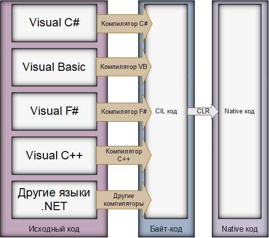

В первой главе говорилось о основной концепции .Net платформы, основным языком которой является C#.
Есть два вида данной платформы .Net Framework(Создание приложений под Windows) .Net Core(Является кроссплатформенной).
На данный момент предпочтительнее изучать .Net Core.
Эти платформы состоят из:
	-CLR(Common Language Runtime)
	-BCL(Base Class Library)

Как видно из картинки выше, сперва компилятор языка который называется Roslyn преобразует все в CIL
(Common Intermedia Language) или Байткод, язык который пока не понятен машинам но и не совсем понятен людям,
это сделано для ускорения и облегчения работы компилятора, а так же байт код легко портируется на различные платформы
для которых реализован компилятор.
Например если интерпретировать язык с помощью интерпритатора то будет переносимость но не скорость,
если скомпилировать код то будет скорость, но невозможность переноса, байткод это золотая середина.

<H1>Историческая справка по .Net Framework и .Net Core</H1>
Начиная с 2002 до 2016 год основной платформой был .Net Framework, но с 2016 года он поддерживается но больше не
разрабатывается, т.к. упор сделан на .Net Core. Их основным отличием является что Framework был только на windows а
Core является кроссплатформенным. На данный момент выпущенна платформа .Net 5, которая является слиянем двух вышесказанных
платформ.

Основные компоненты .Net Framework

<H1>Немного о C#</H1>
Когда говорят о C# то чаще имеют ввиду платформу .Net, при этом сама же платформа включает себя несколько языков.
Сам язык поддерживает ООП, чаще применяет две парадигмы, это ООП(Объектно-ориентированное программирование) и 
функциональное программирование.
Язык является статически типизированным, это значит что тип переменной не меняется до конца ее жизни. (В отличие от
того же Python а, где тип переменной определяется компилятором)

